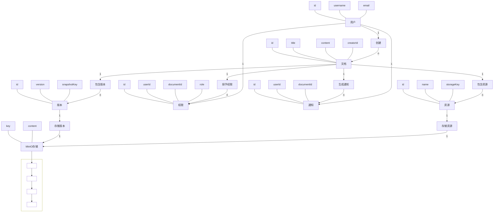
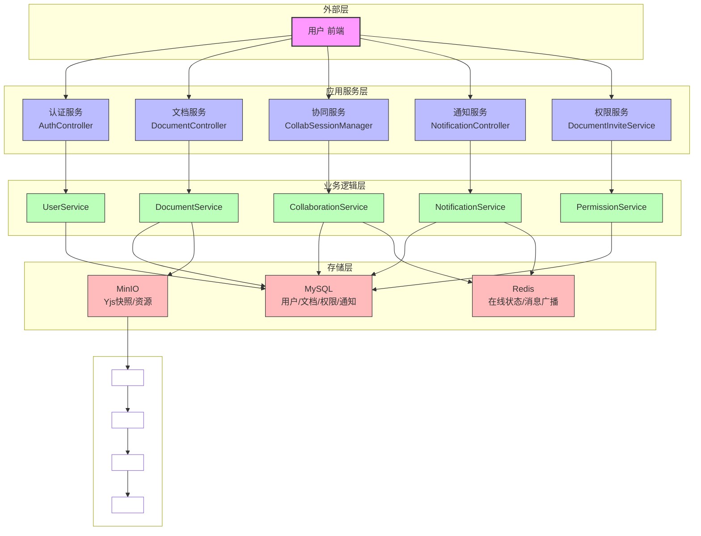
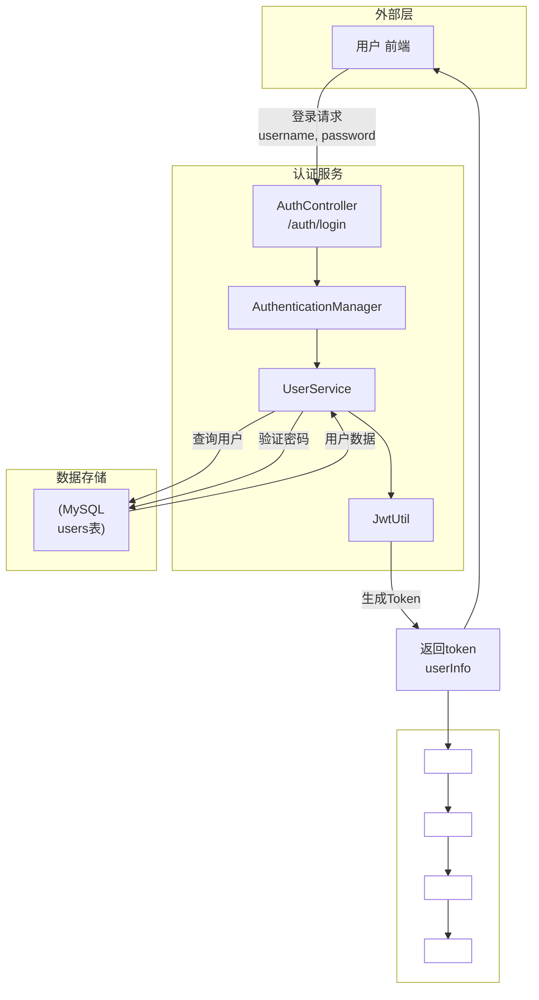
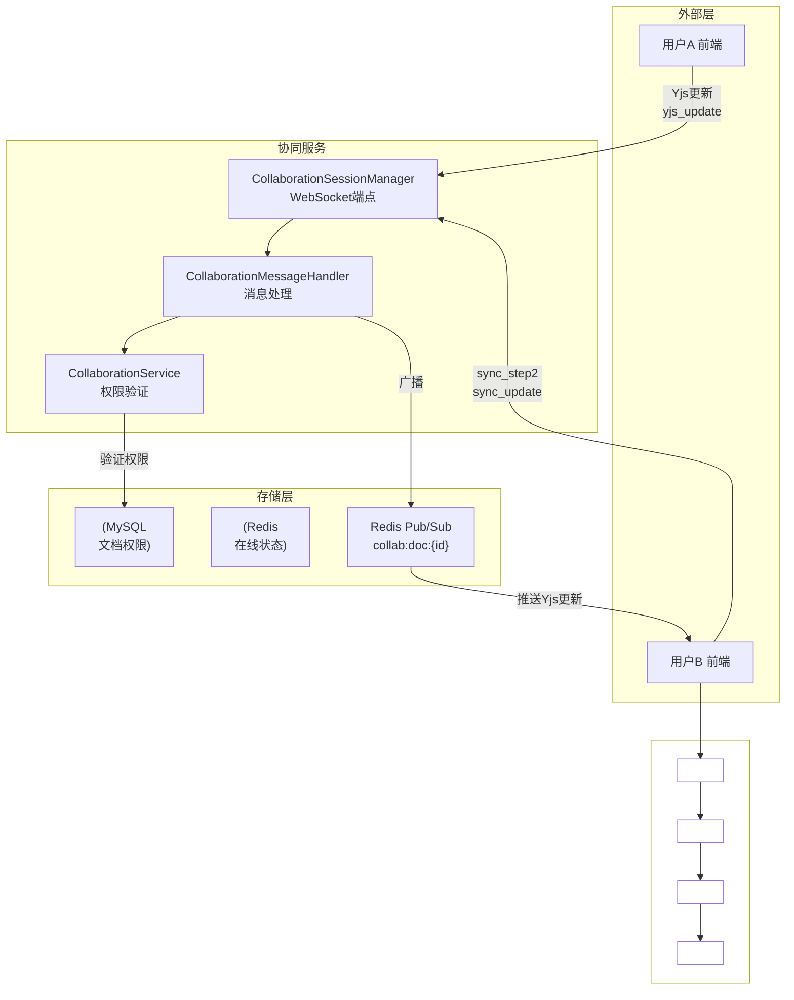
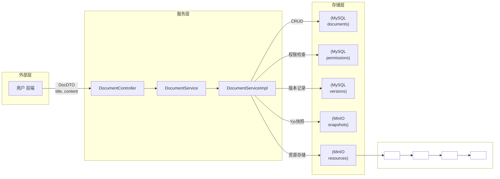
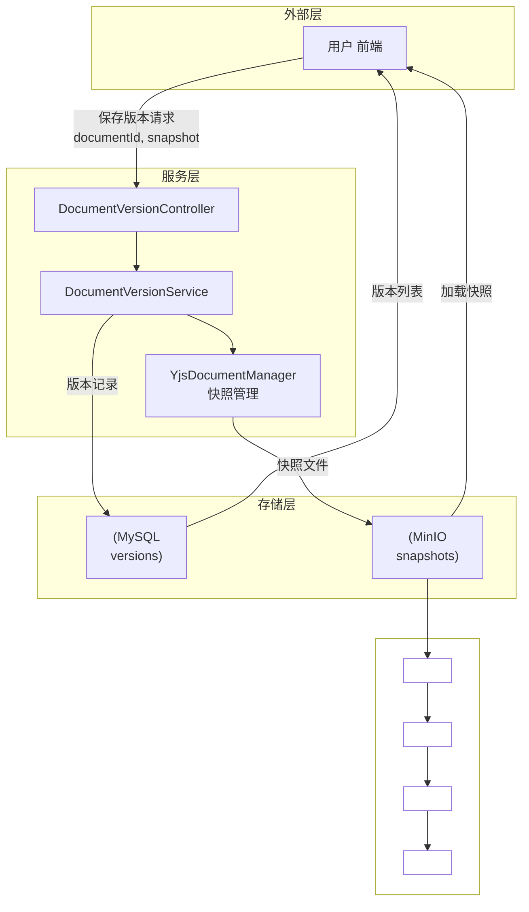
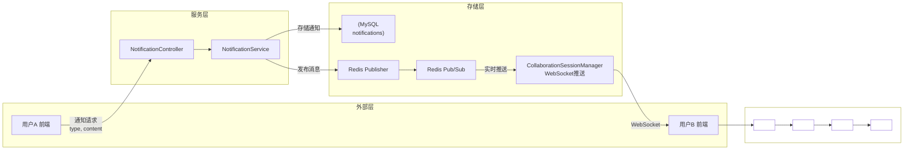
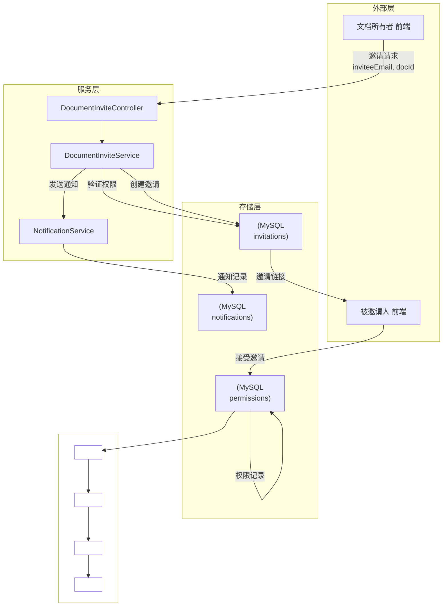
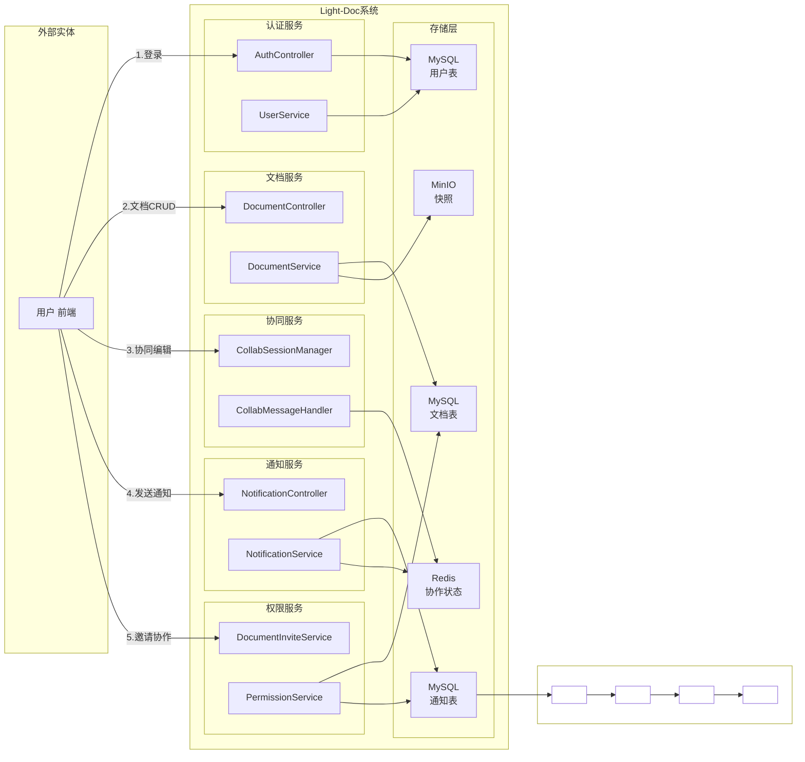

# Light-Doc 数据库 ER 图

## 核心ER图说明

### 实体（Entities）
- **用户**：系统用户
- **文档**：协同文档
- **版本**：文档历史版本
- **权限**：用户对文档的访问权限
- **通知**：系统通知消息
- **资源**：文档附件
- **MinIO存储**：存储文档快照和资源

### 核心关系
- **用户 - 文档**：1:N（用户创建多个文档）
- **文档 - 版本**：1:N（文档有多个版本）
- **文档 - 权限**：1:N（文档授予多个权限）
- **用户 - 权限**：1:N（用户拥有多个权限）
- **文档 - 通知**：1:N（文档生成多个通知）
- **用户 - 通知**：1:N（用户接收多个通知）
- **文档 - 资源**：1:N（文档包含多个资源）
- **版本 - MinIO**：1:1（版本存储在MinIO）
- **资源 - MinIO**：1:1（资源存储在MinIO）

### 存储说明
- **MySQL**：存储结构化数据（用户、文档、版本、权限、通知）
- **MinIO**：存储非结构化数据（文档快照、文件资源）
- **Redis**：存储在线状态、消息队列等临时数据（未在ER图中体现）

---

# Light-Doc 系统框架图

## 框架说明

| 层次 | 组件 | 职责 |
|------|------|------|
| **外部层** | 用户前端 | 与用户交互的界面 |
| **应用服务层** | 各控制器 | 处理HTTP/WebSocket请求 |
| **业务逻辑层** | 各服务 | 实现核心业务逻辑 |
| **存储层** | MySQL/Redis/MinIO | 数据持久化与缓存 |

## 核心技术栈

- **前端**：可能使用React/Vue等框架
- **后端**：Spring Boot + Java
- **存储**：MySQL + Redis + MinIO
- **实时通信**：WebSocket + Redis Pub/Sub
- **协同编辑**：Yjs CRDT

该框架图简洁展示了系统的整体结构和各组件间的关系，便于理解系统架构。

---

# Light-Doc 核心数据流图 (DFD)

---

## 1. 用户认证数据流

---

## 2. 协同编辑数据流 (核心)

---

## 3. 文档管理数据流

---

## 4. 文档版本管理数据流

---

## 5. 通知消息数据流

---

## 6. 邀请协作者数据流

---

## 顶层数据流全景图 (Context Diagram)

---
